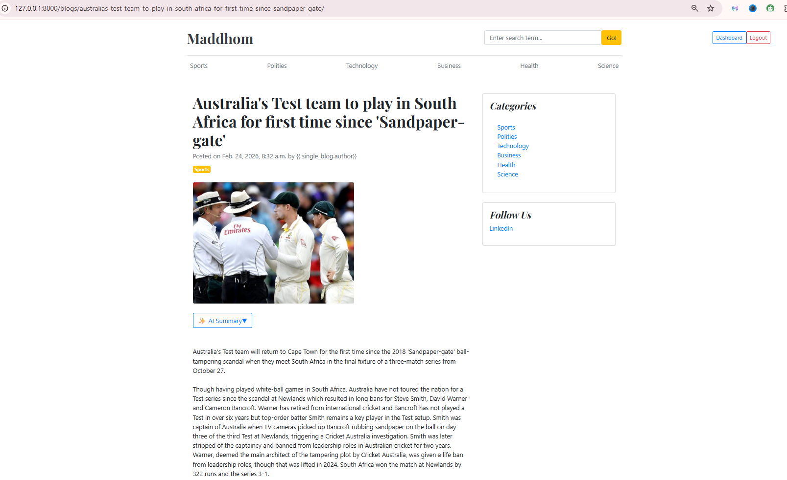
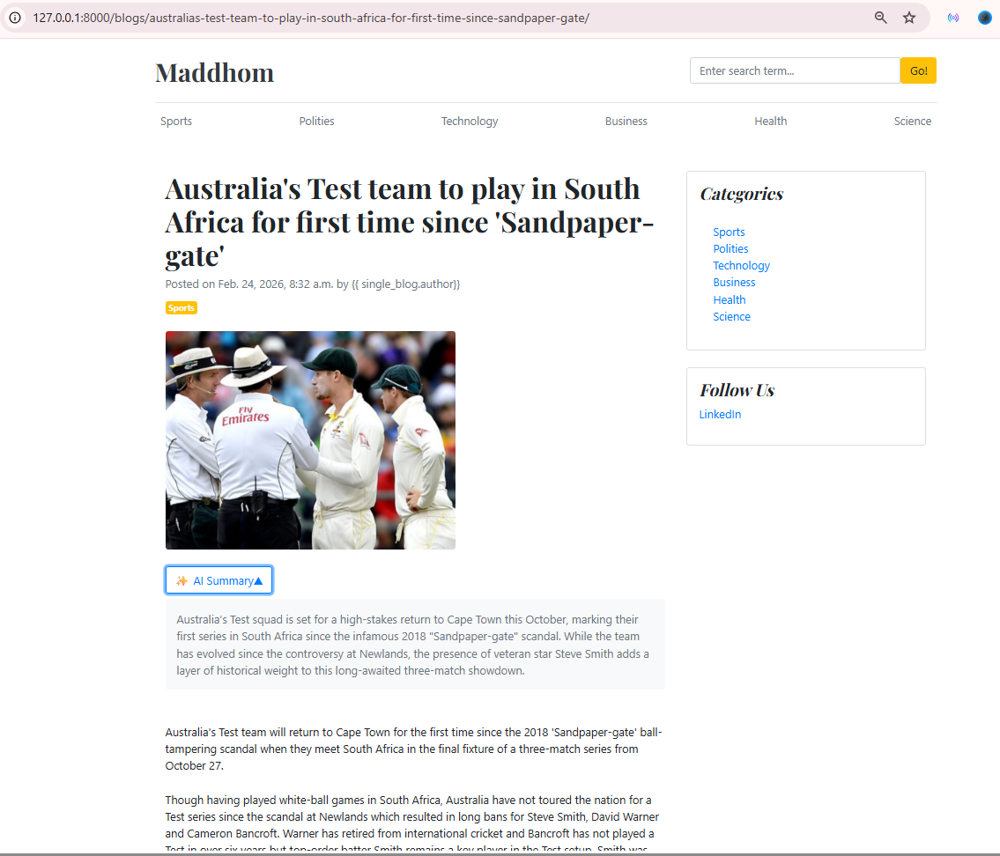
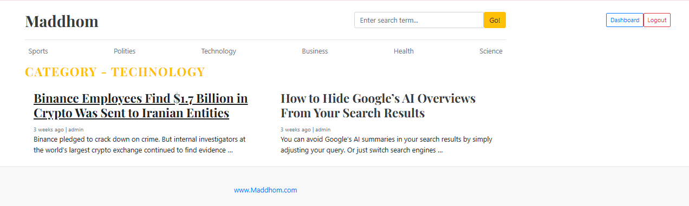
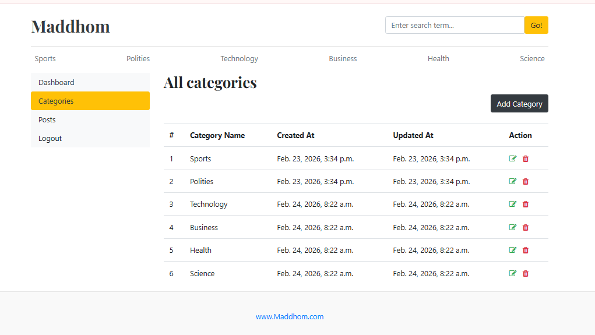
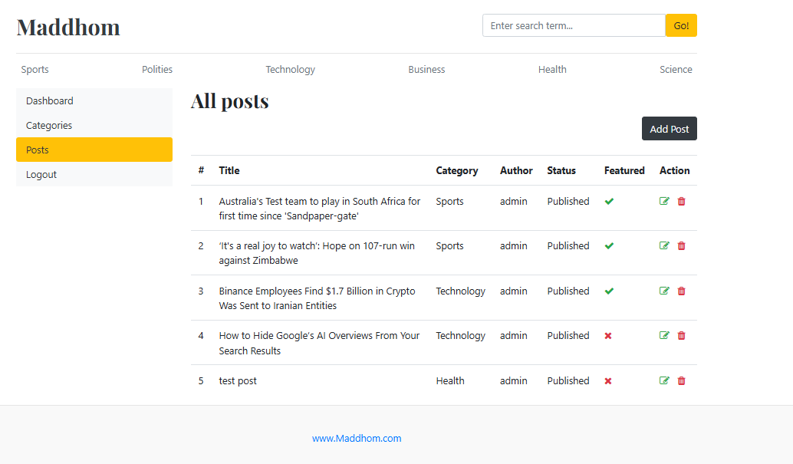

# Maddhom
A Django-based blogging platform where people can read and write short articles across multiple categories. It features a role-based user system, commenting, and AI-powered article summarization.

---

## ✨ Features

### 📝 Articles
- Create and publish articles across categories: **Sports, Politics, Technology, Business, Health, and Science**
- Each article supports a title, short description, full body, featured image, and category tag
- AI-generated summary on every article page powered by **Google Gemini**

### 👥 Role-Based Users
| Role | Permissions |
|------|-------------|
| **Manager** | Add editors, add posts |
| **Editor** | Add posts |
| **Reader** | Read articles, write comments |

### 💬 Comments
- Authenticated users can comment on any article
- Comments display the author name and time posted

### 🤖 AI Summary
- Every article page includes an **AI Summary** button
- Click to reveal a 2–3 sentence summary generated by Google Gemini
- Summarizes both the short description and the full article body

---

## 🛠️ Tech Stack

- **Backend:** Python, Django
- **Frontend:** HTML, Bootstrap 5
- **Database:** SQLite
- **AI:** Google Gemini API (`gemini-3-flash-preview`)

---

## 🚀 Getting Started

### 1. Clone the repository
```bash
git clone https://github.com/Shuvo018/Maddhom.git
cd Maddhom
```

### 2. Create a virtual environment
```bash
python -m venv venv
source venv/bin/activate  # On Windows: venv\Scripts\activate
```

### 3. Install dependencies
```bash
pip install -r requirements.txt
```

### 4. Set up API

```
GEMINI_API_KEY=your-gemini-api-key
```

> Get a free Gemini API key at [aistudio.google.com](https://aistudio.google.com)

### 5. Apply migrations
```bash
python manage.py migrate
```

### 6. Create a superuser
```bash
python manage.py createsuperuser
```

### 7. Run the development server
```bash
python manage.py runserver
```

Visit `http://127.0.0.1:8000` in your browser.

---


## 📸 Screenshots
  <h2>Home page</h4>
  

  
<h2>Article page</h4>
  
  

  
  <h2>Category page</h4>
  

  
  <h2>Dashboard page</h4>
  
  
  
  
---

